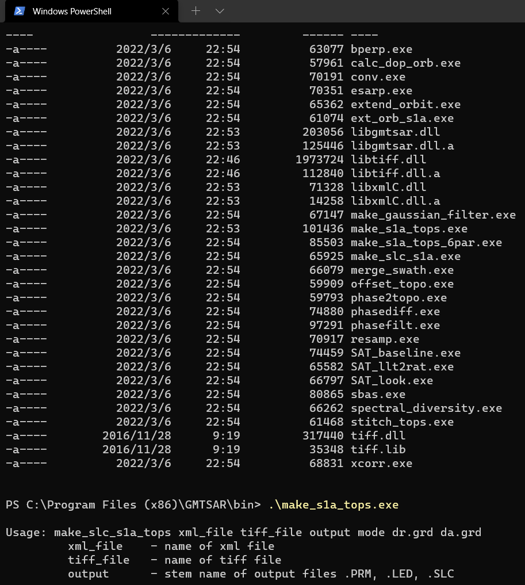

__INSTRUCTIONS FOR INSTALLING GMTSAR ON Windows__
----------------------------------------------

## This is only for Sentinel-1
__INSTALL_ON_WINDOWS__

1) Install mingw64.

2) Install cmake.

3) Go to the gmtsar directory and enter:

       mkdir build
       cd build

4) To build all executables, type

       make
       make install

